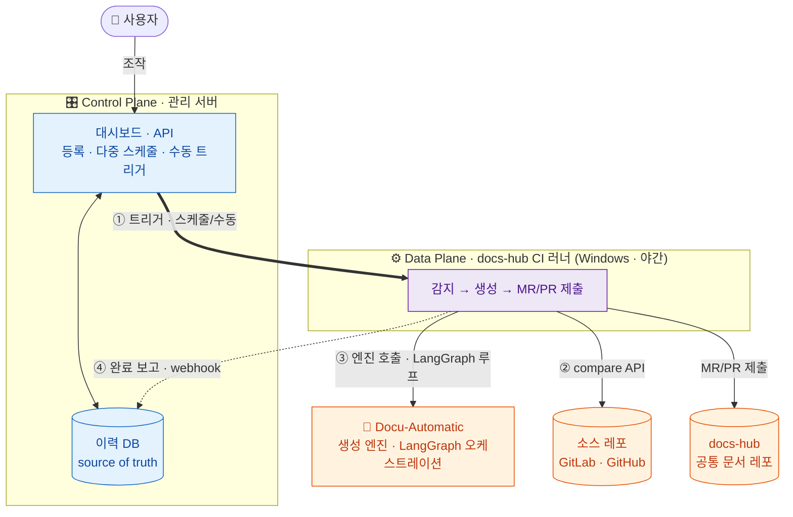
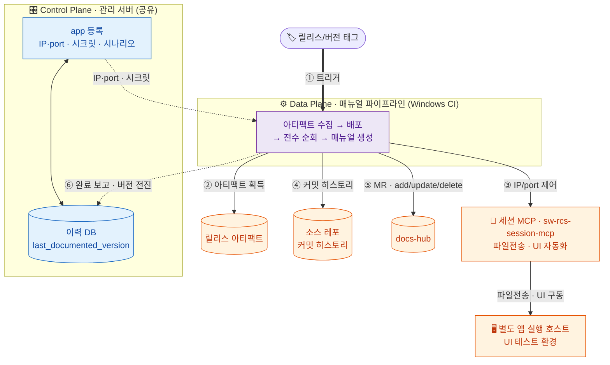
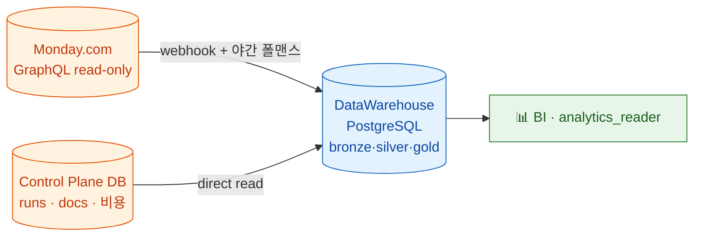

사내 GitLab 과제 레포들(X-LAB/ROC/Smart-ROS/SW-RCS)의 문서화를 AI로 자동화해, 공통 문서 레포
**docs-hub(product-common)**에 **MR/PR로 제출**하는 시스템. 문서는 **두 모달리티**(정적=코드, 행위=실행 앱)로 만든다.

## 파이프라인 2종

|                                 | 입력 → 산출물                   | 트리거           | 산출 채널                   |
| ------------------------------- | -------------------------- | ------------- | ----------------------- |
| **① 정적** (Docu-Automatic)       | 코드 diff → 기술문서             | 야간 배치 · 수동    | docs-hub **MR** (사람 리뷰) |
| **② 매뉴얼 추출** (Manual-Automatic) | 릴리스 앱 실행·관측 → 사용자/엔지니어 매뉴얼 | 릴리스/버전 **태그** | docs-hub **MR** (사람 리뷰) |

**두 파이프라인 모두 MVP 첫 출시 범위에 든다**(2026-07-07 확정 → [[decision-mvp-scope]]). SCM 커넥터는
MVP에서 **다중 인스턴스 + GitHub까지** 붙는다 — 사내 GitLab·gitlab.com·github.com을 소스로 등록 가능
(2026-07-07 승격 → [[decision-scm-multi-instance-github-mvp]], 원래 "GitLab 1개" 절단선을 부분 번복). 코드 인덱스는 한때 ③번 파이프라인이었으나
**2026-07-06 범위에서 제외**됐다 — 개발자 개인 관리로 이관(아래 "범위 제외" 절).

두 파이프라인이 공유하는 뼈대:

- **Control/Data Plane 분리** — 관리 서버(대시보드 + 이력 DB = source of truth)는 *무엇을 어떤 파이프라인으로 언제* 실행할지만 지휘하고,
  AI 생성 같은 무거운 작업은 **사내 Windows CI 러너**(Data Plane)에 격리한다 → [[decision-control-data-plane-split]].
  이 분리는 추후 LLM Wiki 통합·서비스화를 위한 포석이기도 하다.
- **SCM 커넥터** — 형상관리 연동을 추상화해 GitLab·GitHub 둘 다 동등한 1급 대상으로 붙는다 → [[decision-scm-connector-abstraction]].
  등록 단위는 **SCM 인스턴스 × 레포**로, 사내 GitLab·gitlab.com·github.com이 각각 하나의 인스턴스(kind·base_url·token)다.
  GitLabConnector는 base_url 주입식이라 사내·gitlab.com이 동일 구현, GitHubConnector는 신규 → [[decision-scm-multi-instance-github-mvp]]
- **실시간 관측성** — 모든 파이프라인은 진행상황을 대시보드에 실시간 보고한다(설계의 1급 제약).
  구체형은 표준 스키마 + 가변 단위 + webhook push → [[decision-pipeline-observability]] · [[concept-observability-contract]] · [[decision-observability-event-contract]].
  엔진이 자체 에이전트가 되면서 **에이전트 스텝**(사고 요약·도구 호출·토큰)까지 드릴다운된다 → [[decision-agent-step-observability]].
  엔진 구현체가 LangGraph로 옮겨간 뒤로는 `get_stream_writer` 커스텀 이벤트가 이 스키마를 채운다 → [[decision-engine-orchestration-langgraph]].
  파이프라인 실패·인증 해지 같은 운영 이벤트는 **역할 기반 실시간 이메일**로 사람에게 푸시된다 → [[decision-email-alerting]]

## ① 정적 파이프라인 — 코드 diff → 기술문서

굵은 화살표(①)가 평면 간 트리거, 점선(④)이 완료 보고다.

- **등록** — 대시보드에서 레포별 project access token으로 **레포 1개 + 개발/배포 브랜치 2개**를 등록한다.
  (project id·default_branch·git URL은 자동 조회, compare dry-run으로 검증) → [[decision-repo-dev-release-registration]]
- **브랜치 → 문서 역할** — 개발 브랜치 = 최신 기술문서(compare 야간), 배포 브랜치 = 릴리스 문서(태그 트리거).
  docs-hub의 `full_namespace_path/{dev|release}/` 하위폴더로 갈린다 → [[decision-docs-hub-folder-rule]]
- **실행** — 트리거(스케줄/수동) → 스케줄 row의 `pipeline_id/mode/branch_role`에 따라 run 생성 → 러너가 처리 대상 수신 → compare API로 변경 파일 집합 →
  frontmatter 매핑으로 영향 테마 산출 → 테마당 1회 엔진 호출 → MR 생성 → **성공 후에만 sha 전진**
- **실패 처리** — compare가 404(브랜치·레포 소실)면 자동 비활성화하고 알린다 → [[decision-branch-loss-policy]]

## ② 매뉴얼 추출 파이프라인 — 앱 관측 → 매뉴얼

정적 흐름이 코드 diff를 읽는다면, 이 파이프라인은 **실행 앱을 실제 구동·관측**해 사용자/엔지니어 매뉴얼을
만든다 → [[entity-manual-pipeline]]. **릴리스/버전 태그**가 트리거이며([[decision-release-tag-trigger]]),
소스를 빌드하지 않고 **릴리스 아티팩트**를 소비한다([[decision-artifact-consumption]]). 대상은
**Windows 설치본(exe/msi)** 으로 한정하고(nuget·container 제외), 릴리스 자산 중 구동할 설치본은
**담당자가 대시보드에서 지정**하며, MCP가 **전송 + 설치 실행(silent install)** 까지 수행해 구동 상태로 만든다
→ [[decision-artifact-type-dispatch]].

- **앱 실행 환경** — 앱은 **별도 UI 테스트 호스트**에서 돌고, 파이프라인이 **세션 MCP**를 통해 IP/port로
  원격 제어한다(대시보드 app 등록 시 IP·port·시크릿 입력) → [[decision-app-host-connection]] · [[entity-remote-control-mcp]]
- **순회 전략** — UI **전수 순회**는 하이브리드: 시나리오 + 자율 탐색 → [[decision-hybrid-app-traversal]]
- **생성 원칙** — 매뉴얼은 **관측한 사실만 근거로** 쓴다 → [[concept-observation-grounding]]
- **기존 매뉴얼과의 diff** — add/update/delete는 **커밋 히스토리 + 관측**을 결합해 판정하고,
  삭제는 MR 제안으로 사람이 확인한다 → [[decision-commit-history-manual-diff]]
- **정적 파이프라인과의 관계** — 관리 서버·docs-hub·MR 게이트만 공유하는 **별개 파이프라인** → [[decision-manual-pipeline-separate]]

## 데이터 웨어하우스 · 분석 통합 (2026-07-09 신규 축)

두 파이프라인의 산출물과 **Monday.com 과제 데이터**를 하나로 통합하는 **세 번째 시스템 축**. 산출물을 docs-hub MR로 내는 것과는 별개로, 분석 가능한 형태로 영구 보존·교차 분석한다 → [[entity-data-warehouse]] · [[summary-dwh-design-plan]].

- **형태** = Kimball 차원 모델링 + Medallion(Bronze/Silver/Gold) layering on PostgreSQL → [[decision-dwh-shape-kimball-medallion]] · [[concept-medallion-dwh-on-postgres]]
- **적재** = Monday webhook(실시간 근사) + 야간 전수 폴링(보정) 하이브리드 · pipeline은 direct read → [[decision-monday-ingest-hybrid]] · [[concept-readonly-saas-cdc]]
- **반정형 처리** = typed long table + JSONB 폴백 + GIN 인덱스 (Monday column value 타입별 JSON 상이) → [[decision-dwh-column-value-hybrid]] · [[concept-monday-column-value-modeling]]
- **SCD** = items/users/boards SCD2 · statuses SCD1 · run/step append-only → [[decision-dwh-scd-strategy]]
- **변환·오케스트레이션** = dbt-postgres + cron-first (→ Airflow 10+ 태스크 시) → [[decision-dwh-transform-dbt]]
- **저장소** = PostgreSQL 단일 클러스터 다른 스키마 → [[decision-dwh-storage-postgres-single]]
- **핵심 가치** = `fact_item_documentation` 브릿지 팩트가 Monday 과제 ↔ wiki_pipeline 문서·run·비용을 잇는다 (과제 진행 ↔ 문서화 자동화 교차 분석)
- **설계 확정 전 열린 질문** 6건 (plan tier · 사용자 매핑 · item↔repo 키 · 볼륨 · 지연 목표 · 다부서) → [[question-monday-plan-tier]] 등

## 범위 제외 — 코드 인덱스 (2026-07-06, 개인 관리 이관)

코드 인덱스는 2026-07-05 ③번 파이프라인(짧은 주기 폴링 → MCP 질의)으로 설계됐으나, **중앙 파이프라인
범위에서 제외**됐다 → [[decision-code-index-out-of-pipeline]]. 소비 지점이 개발자 개인의 로컬 작업
트리라서 개인 로컬 도구가 구조적으로 우월하고(원격 동기화 문제 자체가 없음), 비-AI 작업이라 중앙에
모을 이유(AI 비용·리뷰 게이트)도 없기 때문. 당시 결정군 8건은 일괄 superseded — 기록은
[[decision-index]]의 코드 인덱스 그룹, 도구 조사는 [[entity-codegraph]](개인 도구 선택 참고 자료) 참조.

## 지금 어디까지 왔나

**Phase 1 핵심 결정** (2026-07-05 확정):

- 산출물은 docs-hub **직접 MR** → [[decision-mr-review-gate]]
- 생성 엔진은 **LangGraph 오케스트레이션** (2026-07-07 전환) — 엔진 인터페이스([[decision-engine-hybrid]]) 계약은 불변이고, 그 뒤의 구현체가 자체 Messages API 루프([[decision-engine-api-agent]], B 확정) → LangGraph 프레임워크로 이동했다(supersede 아닌 구현체 갱신). 판단 루프를 LangGraph 그래프로 짜고, 에이전트의 사고·동작·진행은 `get_stream_writer` 커스텀 이벤트로 대시보드에 출력한다. OpenAI Agents SDK는 트레이싱 OpenAI 백엔드 강제로 탈락, Claude Agent SDK는 M3 불일치로 비채택(Anthropic 회귀 시 재고) → [[decision-engine-orchestration-langgraph]] · [[decision-agent-step-observability]]
- 모델 공급자는 **중립 설계, PoC = MiniMax M3** (Anthropic 확정 → 중립 전환, 2026-07-07) — base URL·키·모델명 교체로 공급자를 갈아끼운다. 인증은 API 키 등록 골격([[decision-engine-api-key-auth]]) 유지, 대상 키만 공급자별. 401 감지 시 admin 이메일. 프로덕션 공급자는 PoC 실측 후 확정 → [[decision-model-provider-neutral-minimax]]
- 러너→AI 네트워크는 뚫려 있음 ✅ → [[question-runner-ai-network]]
- 1차 테마 **4→6 확장** (dev-guide·api-protocol〈백엔드 opt-in〉, 2026-07-06) — 활성화는 소스별 테마 체크리스트, dev-guide 근거는 코드+레포 문서 → [[decision-theme-scope-expansion]] · [[decision-theme-activation-checklist]] · [[decision-devguide-grounding-scope]]

**Phase 2 인프라 결정**:

- 관리 서버 = **사내 VM + 자체 토큰** → [[decision-server-vm-self-token]]. 구현 스택은 **Python FastAPI**(Data Plane LangGraph와 언어 일치로 이벤트 스키마·DB 모델·커넥터 공유) → [[decision-control-plane-fastapi]], DB는 **PostgreSQL**(API·스케줄러·webhook 동시 쓰기·트랜잭션, POC SQLite에서 이관) → [[decision-control-plane-postgresql]] (2026-07-07 확정)
- 스케줄 = **소스별 다중 스케줄 + 파이프라인 선택 + 대시보드 설정** → [[decision-schedule-per-source]]
- 소스 등록 = **레포 1개 + 개발/배포 브랜치 2개** → [[decision-repo-dev-release-registration]]
- 매뉴얼 파이프라인의 앱 실행/연결([[decision-app-host-connection]])·AI 호출 경로([[question-mcp-auth-network]] ✅) 확정

**MVP 절단선 확정** (2026-07-07):

- **MVP = 정적 + 매뉴얼 두 파이프라인 모두** → [[decision-mvp-scope]]. 위키 후보안(정적만)을 사용자가 매뉴얼 포함으로 확대해 open→decision으로 굳었다 → [[question-mvp-scope]] ✅. 매뉴얼 포함으로 매뉴얼 open 질문이 MVP 블로커로 승격됐고, 그중 **아티팩트 타입 dispatch가 2026-07-07 해소**됐다 → [[question-artifact-type-dispatch]] ✅. SCM은 원래 "GitLab 1개, GitHub는 이후"였으나 **2026-07-07 부분 번복** — SCM 다중 인스턴스(사내 GitLab·gitlab.com·github.com) + GitHub 커넥터를 MVP로 승격 → [[decision-scm-multi-instance-github-mvp]].
- 등록 baseline = **A(null → 전체 코드베이스 initialize)**, 초기 전량 backfill을 정기 야간 배치와 분리된 1급 작업으로 → [[decision-registration-baseline]] · [[question-initial-backfill-baseline]] ✅
- 방치 소스 = **운영자 수동 큐레이션**(자동 판정 없음) → [[decision-source-manual-curation]] · [[question-ci-less-source-policy]] ✅
- requirements ↔ dev-guide 경계 = **통합 없이 독자 축으로 명시** → [[decision-requirements-devguide-boundary]] · [[question-requirements-devguide-boundary]] ✅
- 아티팩트 타입 dispatch = **exe/msi만 구동 대상 · 담당자가 대시보드에서 자산 지정 · MCP가 전송+설치 실행(silent install)까지** → [[decision-artifact-type-dispatch]] · [[question-artifact-type-dispatch]] ✅. 매뉴얼 파이프라인이 Windows 설치본 대상으로 구체화됐다.

**미해결 (열린 질문)**:

- 매뉴얼 MVP 블로커 중 트리거 확정이 남아 있다 → [[question-release-object-vs-tag-trigger]] (아티팩트 타입 dispatch는 해소 → [[decision-artifact-type-dispatch]])
- **클라우드 SCM 아웃바운드 네트워크 경로**(github.com·gitlab.com) — Phase 1 SCM 커넥터 실측을 막는 blocker, AI API는 뚫렸으나 클라우드 SCM은 미확인 → [[question-cloud-scm-network]] ⛔
- 클라우드 SCM 토큰 발급 정책·rate limit → [[question-cloud-scm-token-policy]]
- (해소) headless 인증 블로커는 자체 에이전트 전환으로 질문 자체가 사라졌다 → [[question-headless-claude-auth]] ✅

**근거 실측**: 인프라·등록 결정은 사내 GitLab을 실제 로그인해 API 표면을 실측한 근거 위에 있다 —
실측 환경은 [[entity-mirero-gitlab]](GitLab 16.3 CE·610 프로젝트·커넥터 3책임 200 실증), 조사 기록은
[[summary-wish-gitlab-api-survey]]. 등록이 project access token으로 완결되는 것도, 브랜치를 API 조회로
채우는 것도 이 실측(그룹 토큰 Owner 필요·default_branch master/main 혼재)에서 나왔다.

## 더 보기

전체 페이지는 허브 인덱스에서 유형별로 드릴다운한다 → [[index]].
