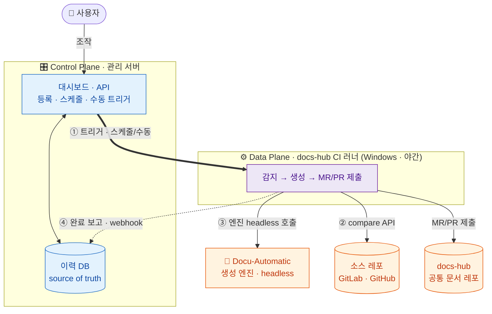
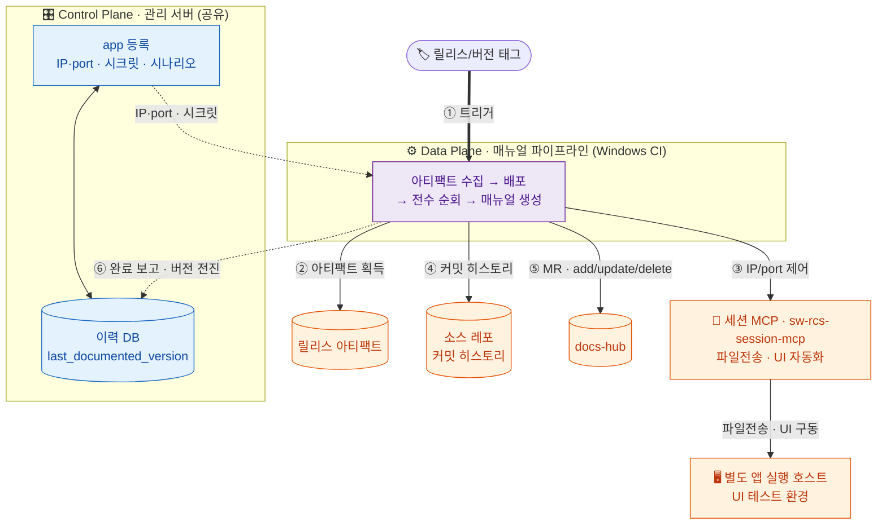

# wiki-pipeline 전체 그림

사내 GitLab 과제 레포들(X-LAB/ROC/Smart-ROS/SW-RCS)의 문서를 AI로 자동화해 공통 문서 레포(docs-hub)에
**MR/PR로 제출**하는 시스템. **두 모달리티**가 나란히 돈다:

- **정적** — 코드 변경을 **야간 배치**로 감지 → 기술문서 재생성 (아래 ① 구조)
- **행위** — **릴리스 앱**을 실제 구동·관측 → 사용자/엔지니어 매뉴얼 (아래 ② 매뉴얼 추출 파이프라인)

문서와 별개로 **코드 인덱스 파이프라인**이 소스 코드를 짧은 주기로 인덱싱해 개발자 조회용 저장소를 유지한다 (아래 ③).
형상관리 연동은 **SCM 커넥터**로 추상화되어 GitLab·GitHub 둘 다(동등한 1급 대상) 붙는다 → [[decision-scm-connector-abstraction]].

## 구조 ① 정적 파이프라인 (Control/Data Plane)

**Control Plane**(관리 서버)은 *무엇을 언제* 처리할지 지휘만 하고(가볍게), **Data Plane**(docs-hub CI 러너)은 AI 생성이라는 무거운 작업을 격리해 수행한다 → [[decision-control-data-plane-split]]. 이 분리는 추후 **LLM Wiki 통합·서비스화**를 위한 포석이기도 하다. 굵은 화살표(①)가 평면 간 트리거, 점선(④)이 완료 보고다.

### 실행 흐름 (정적)

소스는 대시보드에서 **레포별 project access token으로 레포 1개**를 등록하고(토큰이 프로젝트를 스코프하고
project id·default_branch·git URL은 자동 조회, compare dry-run으로 검증), 그 등록 안에 **개발 브랜치 1 + 배포 브랜치 1**을
지정한다 → [[decision-repo-dev-release-registration]]. 두 브랜치는 역할이 다른 문서를 낳아(개발=최신 기술문서·compare 야간,
배포=릴리스 문서·태그 트리거) docs-hub의 `full_namespace_path/{dev|release}/` 하위폴더로 갈린다 → [[decision-docs-hub-folder-rule]].
이후 트리거(스케줄/수동) → 러너가 처리 대상 수신 → compare API로 변경 파일 집합 → frontmatter 매핑으로 영향 테마 산출 →
테마당 1회 엔진 호출 → MR 생성 → **성공 후에만** sha 전진. compare가 404(브랜치·레포 소실)면 자동 비활성화하고 알린다 → [[decision-branch-loss-policy]].

## 구조 ② 매뉴얼 추출 파이프라인 (행위 모달리티)

정적 흐름이 **코드 diff → 기술문서**라면, 별개의 신규 파이프라인이 **실행 앱 관측 → 사용자/엔지니어 매뉴얼**을 담당한다 → [[entity-manual-pipeline]]. **릴리스/버전 태그**가 트리거이며([[decision-release-tag-trigger]]), 소스를 빌드하지 않고 **릴리스 아티팩트**를 소비한다([[decision-artifact-consumption]]).

앱은 **별도 UI 테스트 호스트**에서 돌고, 파이프라인은 그 호스트를 **IP/port로 세션 MCP를 통해 제어**한다(대시보드 app 등록 시 IP·port·시크릿 입력) → [[decision-app-host-connection]] · [[entity-remote-control-mcp]]. MCP가 파일전송으로 아티팩트를 배포·기동하고 UI를 **전수 순회**(하이브리드: 시나리오 + 자율 탐색 → [[decision-hybrid-app-traversal]])하며 **관측한 사실을 근거로**([[concept-observation-grounding]]) 매뉴얼을 만든다. 기존 완성 매뉴얼 대비 add/update/delete는 **커밋 히스토리와 관측을 결합**해 판정하고, 삭제는 MR 제안으로 사람이 확인한다 → [[decision-commit-history-manual-diff]].

두 파이프라인은 모두 **사내 Windows CI(Data Plane)** 위에서 돌며, 관리 서버·docs-hub·MR 게이트만 공유한다 → [[decision-manual-pipeline-separate]].

## 구조 ③ 코드 인덱스 파이프라인 (개발자 조회)

문서 파이프라인들과 별개로, 등록된 소스 레포의 코드를 인덱싱해 **개발자가 직접 조회**(코드 검색·code traversal)하는
저장소로 유지한다 → [[decision-code-index-pipeline]]. 비-AI·빠름·결정적이라 야간 배치가 아닌 **짧은 주기 폴링**으로
commit 수준 신선도를 가진다(쓰기 경로) — pull 메커니즘(compare + sha 포인터)은 주기만 바꿔 재사용한다.

- **소스 확보**: 러너가 **git clone/fetch**로 직접 확보한다. 인증 토큰만 SCM 커넥터의 auth에서 얻는다 —
  git 프로토콜은 SCM 중립이라 커넥터 4책임 확장은 기각 → [[decision-runner-git-clone]]
- **질의(읽기) 채널**: **MCP 서버**로 제공 — 개발자(와 그 AI 코딩 도구)가 MCP에 붙어 코드베이스를 빠르게 스캔·순회한다.
  자체 웹 UI·IDE 플러그인은 후순위 → [[decision-code-index-mcp-serving]]
- **형상 관리**: 인덱스는 **버전 스냅샷**으로 관리되며, 재인덱싱 **중에도** 직전 버전이 계속 질의를 서빙한다
  (쓰기가 읽기를 막지 않는다). 빌드 완료 후 원자적으로 교체 → [[decision-code-index-versioning]]
- **어댑터**: 첫 구현 어댑터는 **cg-colby**(`colbymchenry/codegraph`)로 확정 — 단일 SQLite, 증분 1급, 레포별 자동 격리.
  cgc는 의존 heavy·Alpha로 기각 → [[decision-code-index-adapter-cg-colby]] · [[entity-codegraph]]
- **질의 범위**: v1은 **단일 레포** 단위. cross-repo 질의는 후순위 → [[decision-code-index-single-repo-scope]]
- **저장소 평면**: 인덱스(파생 데이터)는 **별도 질의 서비스 평면**(현재 MCP 서버)이 직접 소유·운영한다.
  관리 서버(Control Plane)·이력 DB(SoT)와 상태를 분리 → [[decision-code-index-store-plane]]

인덱싱 기술(codegraph)은 **프로바이더 인터페이스**(index/query/manage) 뒤로 숨겨 교체 가능하다
→ [[decision-code-index-provider-abstraction]] · [[concept-port-adapter]].
산출물은 MR이 아니라 인덱스 저장소(파생 데이터)라 사람 리뷰 게이트가 없다.

## 공통 — 실시간 모니터링

세 파이프라인(과 앞으로 추가될 것들)은 모두 실행 진행상황을 관리 서버 대시보드에 **실시간으로** 보고한다 — 이기종이라도 공통 관측성 계약을 따르며, 모니터링은 파이프라인 설계의 1급 제약이다 → [[decision-pipeline-observability]] · [[concept-observability-contract]]. 진행 이벤트의 구체형은 **표준 스키마 + 가변 단위 + webhook push**로 확정됐다 → [[decision-observability-event-contract]].

## 더 보기

전체 페이지는 허브 인덱스에서 유형별로 드릴다운한다 → [[index]].

**Phase 1 핵심 결정(2026-07-05 확정)**: 산출물은 docs-hub 직접 MR([[decision-mr-review-gate]]) · 생성 엔진은 하이브리드 — 엔진 인터페이스를 정의하고 당분간 `claude -p` headless, 필요 시 자체 에이전트로 교체([[decision-engine-hybrid]]). headless 인증/동작 검증만 남음([[question-headless-claude-auth]], Phase 1 첫 스프린트에서 즉시 검증). 러너→AI 네트워크는 뚫려 있음([[question-runner-ai-network]] ✅).

**Phase 2 인프라 결정**: 관리 서버 = 사내 VM + 자체 토큰([[decision-server-vm-self-token]]) · 스케줄 = 과제별 대시보드 설정([[decision-schedule-per-source]]) · 소스 등록 = 레포 1개 + 개발/배포 브랜치 2개([[decision-repo-dev-release-registration]]). 매뉴얼 파이프라인은 앱 실행/연결([[decision-app-host-connection]])·AI 호출 경로([[question-mcp-auth-network]] ✅)가 확정됐다.

이 인프라·등록 결정은 사내 GitLab을 실제로 로그인해 API 표면을 실측한 근거 위에 얹혀 있다 — 실측 환경은 [[entity-mirero-gitlab]](GitLab 16.3 CE·610 프로젝트·커넥터 3책임 200 실증), 조사 기록은 [[summary-wish-gitlab-api-survey]]. 등록이 project access token으로 완결되는 것도, 브랜치를 API 조회로 채우는 것도 이 실측(그룹 토큰 Owner 필요·default_branch master/main 혼재)에서 나왔다.
