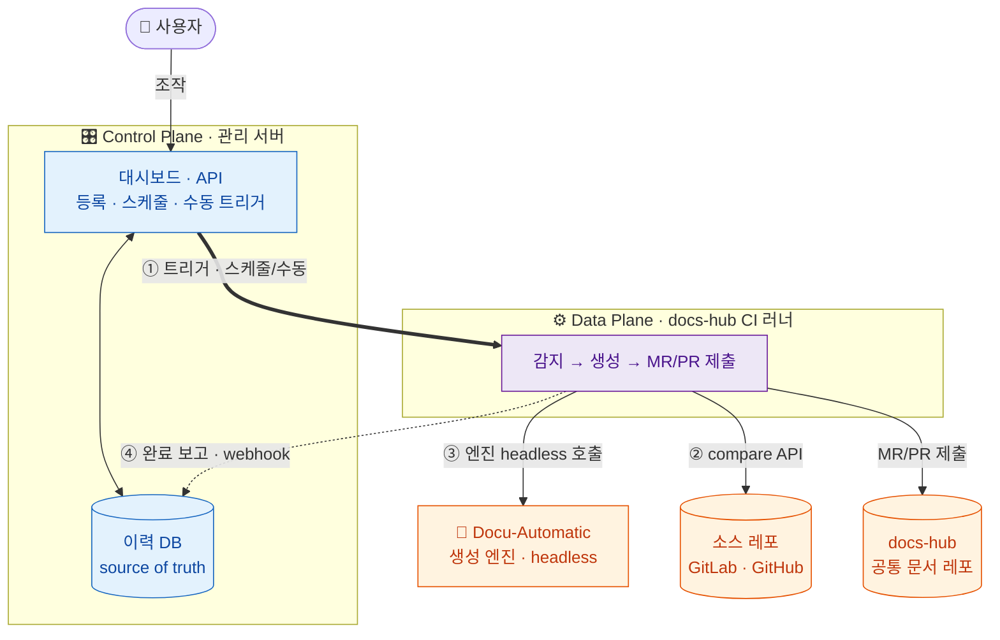

# wiki-pipeline 전체 그림

사내 GitLab 과제 레포들(X-LAB/ROC/Smart-ROS/SW-RCS)의 변경을 **야간 배치**로 감지해,
AI 생성 엔진이 공통 문서 레포(docs-hub)의 영향받은 문서만 재생성하고 **MR/PR로 제출**하는 시스템.
형상관리 연동은 **SCM 커넥터**로 추상화되어 GitLab·GitHub 둘 다(동등한 1급 대상) 붙는다 → [[decision-scm-connector-abstraction]].

## 구조 (Control/Data Plane)

**Control Plane**(관리 서버)은 *무엇을 언제* 처리할지 지휘만 하고(가볍게), **Data Plane**(docs-hub CI 러너)은 AI 생성이라는 무거운 작업을 격리해 수행한다 → [[decision-control-data-plane-split]]. 이 분리는 추후 **LLM Wiki 통합·서비스화**를 위한 포석이기도 하다. 굵은 화살표(①)가 평면 간 트리거, 점선(④)이 완료 보고다.

## 실행 흐름

트리거(스케줄/수동) → 러너가 처리 대상 수신 → 소스별 compare API로 변경 파일 집합 →
frontmatter 매핑으로 영향 테마 산출 → 테마당 1회 엔진 호출 → MR 생성 → **성공 후에만** sha 전진.

## 더 보기

전체 페이지는 허브 인덱스에서 유형별로 드릴다운한다 → [[index]]. 최우선 확인 대상은 **Phase 1 블로킹 질문 3건**(⛔): [[question-runner-ai-network]] · [[question-headless-claude-auth]] · [[question-mr-vs-docs-auto]].
